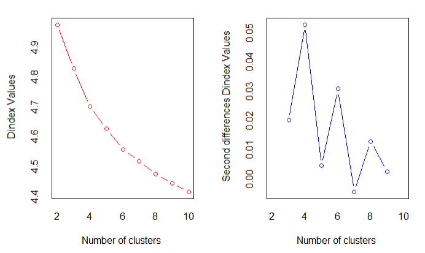

```{r setup, include=FALSE}
knitr::opts_chunk$set(echo = TRUE)
```

## Notes/Assumptions
- As stated [here](https://datascience.stackexchange.com/questions/22/k-means-clustering-for-mixed-numeric-and-categorical-data?answertab=votes#tab-top), k-means clustering can not be immediately used with categorical data. For this reason, we will focus on the quantitative data for the purpose of segmentation.
- We also do not want to categorize based on IDs since these are arbitrarily assigned and are not measuring some intrinsic property; thus, we exclude these columns as well.
- Segmentation is only based on variables measured on the initial day.
- Finally, including `PANSS_Total` is redundant so our relavent columns are just the 30 assessments.
- We do not use cross-validation for determing parameters like $k$ in $k$-means clustering because to do so we need some sort of "ground truth" (e.g. see [here](https://stats.stackexchange.com/questions/200254/cross-validation-for-k-means-clustering-in-r/246749) or [here](https://stackoverflow.com/questions/6629165/k-fold-cross-validation-for-determining-k-in-k-means)). Better to pick the number of clusters via cluster stability, etc. 

## Thoughts/Conclusions
- `clValid` reported k-means with k = 2 as the algorithm of choice 3 times out 7 for the various performance measures. PAM (k-medoids) was selected once with k = 2. The next largest value of k chosen in this way was 6. To reduce model complexity, let's select k = 2. 
- This is corroborated by the fact that k-means with k = 2 produced the maximal average silhouette width. Silhouette also suggests that k =2 is optimal for PAMS as well. 
- Note that from the average silhouette width plots, there is little to be gained from going past k = 5 and 6 for k-means and pams respectively. 
- Furthermore, gap statistic has a clear elbow at k = 2 for k-means and PAM. And when considering 30 different indices for clustering performance, 10 proposed 2 as the best number of clusters while only 4 proposed 3 as the best number of clusters (for k-means). 
- Visually this seems like an acceptable result. Both PAM (k-medoids) and k-means are neatly separated along the first principal component in this way into clusters of roughly the same size. The boundary falls right at the zero-point for the first principal component. 
- This principal component is mostly explained by P2, G15, P1, P6, G9, and G11 respectively in that order. I.e. the patients are mainly separated by how they scored on positive symptoms and general psychology symptoms. 
- Indeed, the first five contributors for the second principal components are all scores related to negative symptoms (recall there are 7 total negative symptom scores). 
- Furthermore, coloring the PCA individual plot by study reveals two interesting trends. People in study A have negative values for PC1 and positive values for PC2 (upper left quadrant) while people in study B are to the far right of the graph (represented by positive values of PC1). 


## Further reading
- [More ideas for feature extraction](https://towardsdatascience.com/10-tips-for-choosing-the-optimal-number-of-clusters-277e93d72d92)
- [Factoextra](http://www.sthda.com/english/wiki/factoextra-r-package-easy-multivariate-data-analyses-and-elegant-visualization?fbclid=IwAR2EzCxaHHeUjofDVhauwiAOXT9YIKB-njM58tTxru1D-MAYgIbxwpeaMqI#principal-component-analysis) is quite an amazing R package. 
- Notes on [cluster validation statistics](https://www.datanovia.com/en/lessons/cluster-validation-statistics-must-know-methods/)


## Setup
```{r Load Libraries, results="hide"}
library(ggplot2)
library(hexbin)
library(RColorBrewer)
library(ggrepel)
library(ggfortify)
library(extrafont)
library(factoextra)
library("FactoMineR")
library(NbClust)
library(cluster)
library(clValid)
library(ggfortify)
```

```{r Load Data}
A_df=read.csv("Data/Study_A.csv")
B_df=read.csv("Data/Study_B.csv")
C_df=read.csv("Data/Study_C.csv")
D_df=read.csv("Data/Study_D.csv")
E_df=read.csv("Data/Study_E.csv")
summary(A_df)
```

### Subset dataframes
Since we only want to examine the first day, we subset the data accordingly. 
```{r first day}
A_df = subset(A_df, VisitDay==0)
B_df = subset(B_df, VisitDay==0)
C_df = subset(C_df, VisitDay==0)
D_df = subset(D_df, VisitDay==0)
E_df = subset(E_df, VisitDay==0)
```

Before performing clustering, we need to remove any extraneous columns. 
```{r remove columns}
A_sub = A_df[ , -which(names(A_df) %in% c("Study","Country","PatientID","SiteID","RaterID",
                "AssessmentiD","TxGroup","VisitDay","PANSS_Total","LeadStatus"))]
B_sub = B_df[ , -which(names(B_df) %in% c("Study","Country","PatientID","SiteID","RaterID",
                "AssessmentiD","TxGroup","VisitDay","PANSS_Total","LeadStatus"))]
C_sub = C_df[ , -which(names(C_df) %in% c("Study","Country","PatientID","SiteID","RaterID",
                "AssessmentiD","TxGroup","VisitDay","PANSS_Total","LeadStatus"))]
D_sub = D_df[ , -which(names(D_df) %in% c("Study","Country","PatientID","SiteID","RaterID",
                "AssessmentiD","TxGroup","VisitDay","PANSS_Total","LeadStatus"))]
E_sub = E_df[ , -which(names(E_df) %in% c("Study","Country","PatientID","SiteID","RaterID",
                "AssessmentiD","TxGroup","VisitDay","PANSS_Total","LeadStatus"))]
names(A_sub)
```

### Merge 
```{r merge}
combined_df = rbind(A_sub,B_sub,C_sub,D_sub,E_sub)
```

### Scale
```{r scale}
A_scale = scale(A_sub)
B_scale = scale(B_sub)
C_scale = scale(C_sub)
D_scale = scale(D_sub)
E_scale = scale(E_sub)
scaled_df = scale(combined_df)
summary(scaled_df)
```

## Deciding on a clustering algorithm 
```{r choosing}
#cvalid.out = clValid(scaled_df, maxitems = 3000, nClust = 2:8, clMethods = c("kmeans","pam"), validation = c("internal", "stability"))
#summary(cvalid.out)
```
We can save time by only running this cell once and loading the results otherwise: 

## K-means clustering 
### Determine optimal number of clusters
```{r optimal-k}
# Elbow method
fviz_nbclust(scaled_df, kmeans, method = "wss",print.summary=TRUE) +
    geom_vline(xintercept = 2, linetype = 2)+
  labs(subtitle = "Elbow method")

# Silhouette method
fviz_nbclust(scaled_df, kmeans, method = "silhouette")+
  labs(subtitle = "Silhouette method")

# Gap statistic
# nboot = 50 to keep the function speedy. Number of Monte Carlo ("bootstrap") samples.
# recommended value: nboot= 500 for your analysis.
# Use verbose = FALSE to hide computing progression.

# set.seed(1)
# gc()
# fviz_nbclust(scaled_df, kmeans,k.max = 8,iter.max=30,nstart = 25,method="gap_stat",nboot = 50)+
#   labs(subtitle = "Gap statistic method")
```
The gap statistic in the above cell is a length computation. Only uncomment when needed. 

### 30 indices for determing value of k 
```{r 30-indices}
# NbClust(data = scaled_df, distance = "euclidean", min.nc = 2, max.nc = 10, method = "kmeans");
```
This cell calculates 30 different indices from which to determine the optimal number of clusters. Again, this is quite a length computation so we run it once and pull the saved figure otherwise: , , and 

### K-means clustering for chosen value of k 
```{r k-means}
set.seed(1)
chosen_k = 2

km.out = kmeans(scaled_df, chosen_k, nstart = 50)
km.clusters =km.out$cluster

# stats
km.out$tot.withinss # total within-cluster sum of squares
km.out$withinss # within-cluster sum of squares
km.out$size # cluster size

# visualize
fviz_cluster(km.out, scaled_df,geom = c("point")) + theme_minimal() + labs(title ="")
```

## Pam clustering

### Determine optimal number of clusters for pam 
```{r optimal-k-pam}
# Elbow method
fviz_nbclust(scaled_df, pam, method = "wss",print.summary=TRUE) +
    geom_vline(xintercept = 2, linetype = 2)+
  labs(subtitle = "Elbow method")

# Silhouette method
fviz_nbclust(scaled_df, pam, method = "silhouette")+
  labs(subtitle = "Silhouette method")

# Gap statistic
# nboot = 50 to keep the function speedy. Number of Monte Carlo ("bootstrap") samples.
# recommended value: nboot= 500 for your analysis.
# Use verbose = FALSE to hide computing progression.

set.seed(1)
fviz_nbclust(scaled_df, k.max = 10, pam,method="gap_stat",nboot = 50)+
 labs(subtitle = "Gap statistic method")
```
As for K-means, we only compute the gap statistic when needed. Otherwise it is commented out. 


### Pam algorithm
```{r pam}
pam.res <- pam(scaled_df, chosen_k)
 # Visualize pam clustering
fviz_cluster(pam.res, geom = "point") + theme_minimal() + labs(title ="")  + theme_minimal() + labs(title ="")
```


## PCA for data interpretation
```{r pca}
pca.out = prcomp(scaled_df, scale=TRUE)
ggplot2::autoplot(pca.out, label = FALSE, loadings.label = TRUE)
```

```{r pca-function}
pcaCharts <- function(x) {
    x.var <- x$sdev ^ 2
    x.pvar <- x.var/sum(x.var)
    print("proportions of variance:")
    print(x.pvar)
    
    par(mfrow=c(2,2))
    plot(x.pvar,xlab="Principal component", 
         ylab="Proportion of variance explained", ylim=c(0,1), type='b')
    plot(cumsum(x.pvar),xlab="Principal component", 
         ylab="Cumulative Proportion of variance explained", ylim=c(0,1), type='b')
    screeplot(x)
    screeplot(x,type="l")
    par(mfrow=c(1,1))
}

# check proportion of variance explained by each component 
pcaCharts(pca.out)
```
From this analysis, it would be reasonable to focus on the first three principal components in terms of describing the clusters. 

```{r pca-loadings}
pca.out$rotation[,1:3]
```

### Cleaner pca analysis
```{r pca-v2}
res.pca = PCA(scaled_df, graph = FALSE)
print(res.pca)
```
### Visualize eigenvalues/variances
```{r percent-explained}
fviz_screeplot(res.pca, addlabels = TRUE, ylim = c(0, 50))
```

### Relationship to predictors
```{r relationship-to-pred}
# Graph of variables: default plot
fviz_pca_var(res.pca, col.var="contrib",
             gradient.cols = c("#00AFBB", "#E7B800", "#FC4E07"),
             repel = TRUE # Avoid text overlapping
             )
```

### contributions for each principal component
```{r pca-contributions}

# Contributions of variables to PC1
fviz_contrib(res.pca, choice = "var", axes = 1, top = 10)

# Contributions of variables to PC2
fviz_contrib(res.pca, choice = "var", axes = 2, top = 10)

# Contributions of variables to PC2
fviz_contrib(res.pca, choice = "var", axes = 3, top = 10)
```

### Individuals pca but colored by study
```{r individuals-study}
omission_vector = c("Country","PatientID","SiteID","RaterID",
                "AssessmentiD","TxGroup","VisitDay","PANSS_Total","LeadStatus")
combined_all_col = rbind(A_df[ , -which(names(A_df) %in% omission_vector)],B_df[ , -which(names(A_df) %in% omission_vector)],C_df[ , -which(names(A_df) %in% omission_vector)],D_df[ , -which(names(A_df) %in% omission_vector)],E_df[ , -which(names(A_df) %in% omission_vector)])


res.pca <- prcomp(combined_all_col[,-1],  scale = TRUE)
fviz(res.pca, "ind", label = "none",habillage=combined_all_col$Study,addEllipses = "True",alpha=0.3,ellipse.type = "convex") # Individuals plot

res.pca <- prcomp(combined_all_col[,-1],  scale = TRUE)
fviz(res.pca, "ind", label = "none",habillage=combined_all_col$Study,addEllipses = "True",alpha=0.3) # Individuals plot
```

### Individuals pca but colored by country
Initially we considered overlaying groups determined by country on the pca plot to see what trends would be observed. This is quite challenging since one would need a different color for each country represented. 
```{r individuals-country}
omission_vector = c("Study","PatientID","SiteID","RaterID",
                "AssessmentiD","TxGroup","VisitDay","PANSS_Total","LeadStatus")
combined_all_col = rbind(A_df[ , -which(names(A_df) %in% omission_vector)],B_df[ , -which(names(A_df) %in% omission_vector)],C_df[ , -which(names(A_df) %in% omission_vector)],D_df[ , -which(names(A_df) %in% omission_vector)],E_df[ , -which(names(A_df) %in% omission_vector)])

library(plyr)
sort(table(combined_all_col$Country),decreasing=TRUE)

# consider only top 5 countries 
countries = c("USA","China","Russia","Japan","Ukraine")
top_5_country_df = subset(combined_all_col, Country %in% countries)

sum(table(top_5_country_df$Country))/sum(table(combined_all_col$Country)) # these countries make up 80%

res.pca <- prcomp(top_5_country_df[,-1],  scale = TRUE)
fviz(res.pca, "ind", label = "none",habillage=top_5_country_df$Country,addEllipses = TRUE,alpha=0.5,ellipse.alpha = 0.25)
```
